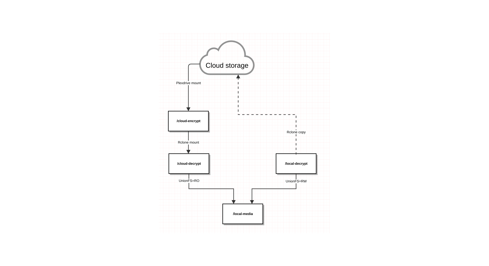

Getting started
===============
## Usage

Default settings use ~100 GB for local media, remove atleast 80 GB and Plexdrive chunks and cache are removed after 24 hours.
```
docker create \
	--name cloud-media-scripts \
	-v /media:/local-media \
	-v /mnt/external/media:/local-decrypt \
	-v /configurations:/config \
	-v /mnt/external/plexdrive:/chunks \
	-v /logs:/log \
	--privileged --cap-add=MKNOD --cap-add=SYS_ADMIN --device=/dev/fuse \
	madslundt/cloud-media-scripts
```

If you have more space you can increase `REMOVE_LOCAL_FILES_WHEN_SPACE_EXCEEDS_GB`, `FREEUP_ATLEAST_GB` and either increase `CLEAR_CHUNK_AGE` or add `CLEAR_CHUNK_MAX_SIZE`.

Example of having `REMOVE_LOCAL_FILES_WHEN_SPACE_EXCEEDS_GB` set to 2TB, `FREEUP_ATLEAST_GB` to 1TB and `CLEAR_CHUNK_MAX_SIZE` to 1TB:
```
docker create \
	--name cloud-media-scripts \
	-v /media:/local-media \
	-v /mnt/external/media:/local-decrypt \
	-v /configurations:/config \
	-v /mnt/external/plexdrive:/chunks \
	-v /logs:/log \
	-e CLEAR_CHUNK_MAX_SIZE="1000G" \
	-e REMOVE_LOCAL_FILES_WHEN_SPACE_EXCEEDS_GB="2000" \
	-e FREEUP_ATLEAST_GB="1000" \
	--privileged --cap-add=MKNOD --cap-add=SYS_ADMIN --device=/dev/fuse \
	madslundt/cloud-media-scripts
```


## Parameters
The parameters are split into two halves, separated by a colon, the left hand side representing the host and the right the container side.
For example with a volume `-v external:internal` - what this shows is the volume mapping from internal to external of the container.
Example `-v /media:/local-media` would expose directory **/local-media** from inside the container to be accessible from the host's directory **/media**

Volumes:
* `-v /local-media` - Union of all files stored on cloud and local
* `-v /local-decrypt` - Local files stored on disk
* `-v /config` - Rclone and plexdrive configurations
* `-v /chunks` - Plexdrive cache chunks
* `-v /data/db` - MongoDB database
* `-v /log` - Log files from mount, cloudupload and rmlocal
* `-v /cloud-encrypt` - Cloud files encrypted synced with Plexdrive
* `-v /cloud-decrypt` - Cloud files decrypted with Rclone

Environment variables:
* `-e BUFFER_SIZE` - Rclone: Buffer size when copying files (default **500M**)
* `-e MAX_READ_AHEAD` - Rclone: The number of bytes that can be prefetched for sequential reads (default **30G**)
* `-e CHECKERS` - Rclone: Number of checkers to run in parallel (default **16**)
* `-e RCLONE_CLOUD_ENDPOINT` - Rclone: Cloud endpoint (default **gd-crypt:**)
* `-e RCLONE_LOCAL_ENDPOINT` - Rclone: Local endpoint (default **local-crypt:**)
* `-e CHUNK_SIZE` - Plexdrive: The size of each chunk that is downloaded (default **10M**)
* `-e CLEAR_CHUNK_MAX_SIZE` - Plexdrive: The maximum size of the temporary chunk directory (empty as default)
* `-e CLEAR_CHUNK_AGE` - Plexdrive: The maximum age of a cached chunk file (default **24h**) - this is ignored if `CLEAR_CHUNK_MAX_SIZE` is set
* `-e MONGO_DATABASE` - Mongo database used for Plexdrive (default **plexdrive**)
* `-e DATE_FORMAT` - Date format for loggin (default **+%F@%T**)
* `-e REMOVE_LOCAL_FILES_BASED_ON` - Remove local files based on `space` or `time` (default **space**)
* `-e REMOVE_LOCAL_FILES_WHEN_SPACE_EXCEEDS_GB` - Remove local files when local storage exceeds this value in GB (default **100**) - this is ignored if `REMOVE_LOCAL_FILES_BASED_ON` is set to time
* `-e FREEUP_ATLEAST_GB` - Remove atleast this value in GB on removal (default **80**) - this is ignored if `REMOVE_LOCAL_FILES_BASED_ON` is set to time
* `-e REMOVE_LOCAL_FILES_AFTER_DAYS` Remove local files older than this value in days (default **10**) - this is ignored if `REMOVE_LOCAL_FILES_BASED_ON` is set to space

`--privileged --cap-add=MKNOD --cap-add=SYS_ADMIN --device=/dev/fuse` must be there for fuse to work within the container.

## Setup
After the docker image has been setup and running, Rclone and Plexdrive need to be configured.

### Rclone
Setup Rclone run `docker exec -ti <DOCKER_CONTAINER> rclone_setup`

3 remotes are needed:
 - Endpoint to your cloud storage.
	- Create new remote [**Press N**]
	- Give it a name example gd
	- Choose Google Drive [**Press 7**]
	- If you have a client id paste it here or leave it blank
	- Choose headless machine [**Press N**]
	- Open the url in your browser and enter the verification code
 - Encryption and decryption for your cloud storage.
	- Create new remote [**Press N**]
	- Give it the same name as specified in the environment variable `RCLONE_CLOUD_ENDPOINT` but without colon (:) (*default gd-crypt*)
	- Choose Encrypt/Decrypt a remote [**Press 5**]
	- Enter the name of the endpoint created in cloud-storage appended with a colon (:) and the subfolder on your cloud. Example `gd:/Media` or just `gd:` if you have your files in root in the cloud.
	- Choose how to encrypt filenames. I prefer option 2 Encrypt the filenames
	- Choose to either generate your own or random password. I prefer to enter my own.
	- Choose to enter pass phrase for the salt or leave it blank. I prefer to enter my own.
 - Encryption and decryption for your local storage.
	- Create new remote [**Press N**]
	- Give it the same name as specified in the environment variable `RCLONE_LOCAL_ENDPOINT` but without colon (:) (*default local-crypt*)
	- Choose Encrypt/Decrypt a remote [**Press 5**]
	- Enter the encrypted folder: **/cloud-encrypt**. If you are using subdirectory append it to it. Example /cloud-encrypt/Media
	- Choose the same filename encrypted as you did with the cloud storage.
	- Enter the same password as you did with the cloud storage.
	- Enter the same pass phrase as you did with the cloud storage.

Rclone documentation if needed [click here](https://rclone.org/docs/)

### Plexdrive
Setup Plexdrive to the cloud. Run the command `docker exec -ti <DOCKER_CONTAINER> plexdrive_setup`

Plexdrive documentation if needed [click here](https://github.com/dweidenfeld/plexdrive/tree/4.0.0)

## Commands
Upload run `docker exec <DOCKER_CONTAINER> cloudupload`

Remove local files run `docker exec <DOCKER_CONTAINER> rmlocal`

Mount local files run `docker exec <DOCKER_CONTAINER> mount`

Check if everything is running `docker exec <DOCKER_CONTAINER> check`

## Cron jobs
Setup cron jobs to upload and remove local files:
 - `@daily docker exec <DOCKER_CONTAINER> cloudupload`
 - `@weekly docker exec <DOCKER_CONTAINER> rmlocal`


# How this works?
Following services are used to sync, encrypt/decrypt and mount media:
 - Plexdrive
 - Rclone
 - UnionFS

This gives us a total of 5 directories:
 - /cloud-encrypt: Cloud data encrypted (Mounted with Plexdrive)
 - /cloud-decrypt: Cloud data decrypted (Mounted with Rclone)
 - /local-decrypt: Local data decrypted
 - /chunks: Plexdrive temporary files and caching
 - /local-media: Union of decrypted cloud data and local data (Mounted with Union-FS)

Cloud is mounted to a local folder (`/cloud-encrypt`). This folder is then decrypted and mounted to a local folder (`/cloud-decrypt`).

A local folder (`/local-decrypt`) is created to contain local media.
The local folder (`/local-decrypt`) and cloud folder (`/cloud-decrypt`) is then mounted to a third folder (`/local-media`) with certain permissions - local folder with Read/Write permissions and cloud folder with Read-only permissions.

Everytime new media is retrieved it needs be added to `/local-media` or directly to `/local-decrypt`.
Keep in mind that if it is written and read from `/local-decrypt` it will sooner or later be removed from this folder depending on the `REMOVE_LOCAL_FILES_BASED_ON` setting. This is only removed from `/local-decrypt` and will still appear in `/local-media` because it will still be accessable from the cloud.

If `REMOVE_LOCAL_FILES_BASED_ON` is set to **space** it will only remove content, starting from the oldest accessed file and if the file is uploaded to the cloud, if local media size has exceeded `REMOVE_LOCAL_FILES_WHEN_SPACE_EXCEEDS_GB` and will only free up atleast `FREEUP_ATLEAST_GB`. If **time** is set it will only remove files older than `REMOVE_LOCAL_FILES_AFTER_DAYS` only if they are uploaded to the cloud.



## Rclone
Rclone 1.36 is currently used and tested.

Rclone is used to encrypt, decrypt and upload files to the cloud. It mounts and decrypts Plexdrive to a different folder (`/cloud-decrypt`) and later encrypts and uploads from a local folder (`/local-decrypt`) to the cloud.

Rclone creates one config file in `/config`: `config.json`. This is used to stored Google Drive api keys and encryption/decryption keys.

## Plexdrive
Plexdrive 4.0.0 is currently used and tested.

Plexdrive is used to mount Google Drive to a local folder (`/cloud-encrypt`).

Plexdrive create two files in `/config`: `config.json` and `token.json`. These are used to store Google Drive api keys.

## UnionFS
UnionFS is used to mount both cloud and local media to a local folder (`/local-media`).

 - Cloud storage `/cloud-decrypt` is mounted with Read-only permissions.
 - Local storage `/local-decrypt` is mounted with Read/Write permissions.

The reason for these permissions are that when writing to the local folder (`/local-media`) it will not try to write it directly to the cloud storage `/cloud-decrypt`, but instead to the local storage (`/local-decrypt`). Later this will be encrypted and uploaded to the cloud by Rclone.


# Build Dockerfile
## Build
`docker build -t cloud-media-scripts .`

## Test run
`docker run --name cloud-media-scripts -d cloud-media-scripts`